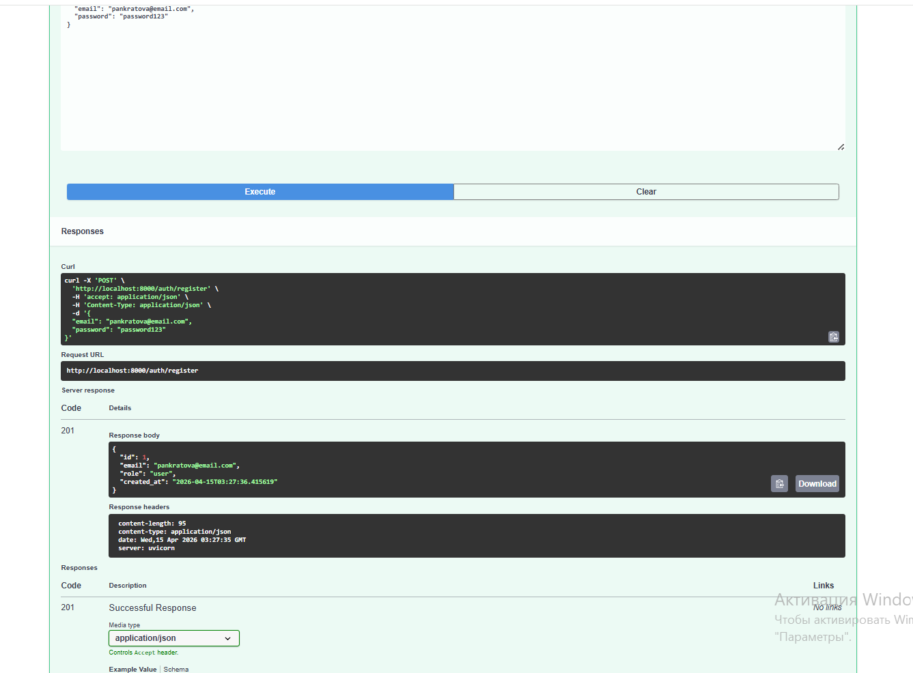
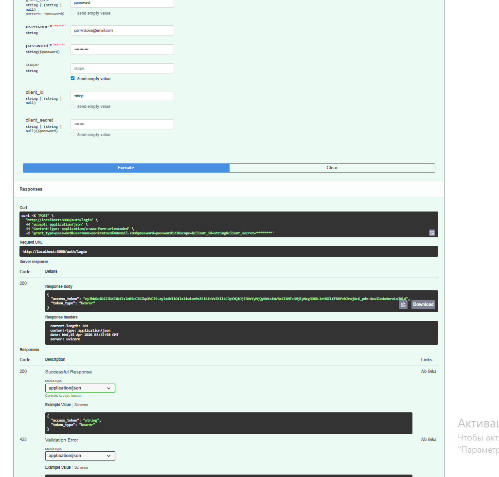
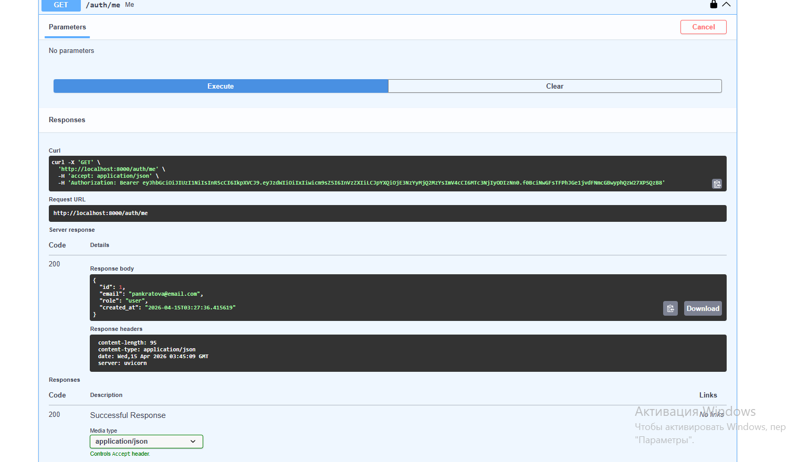
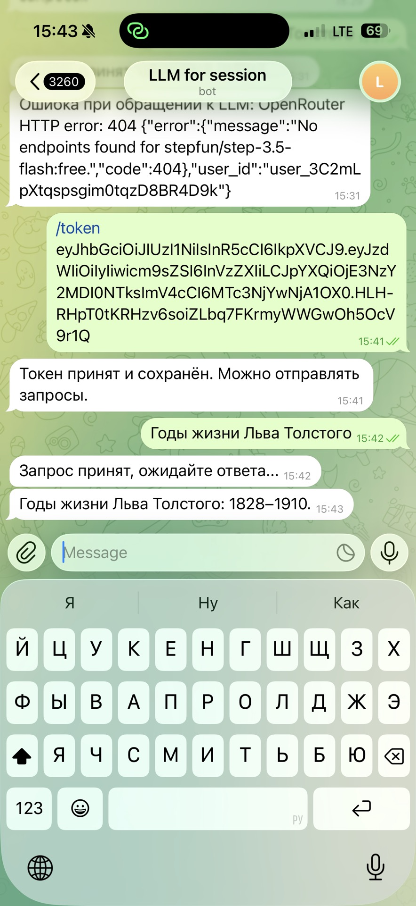
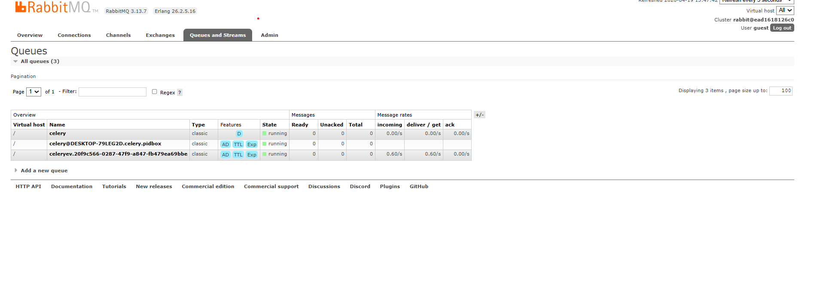
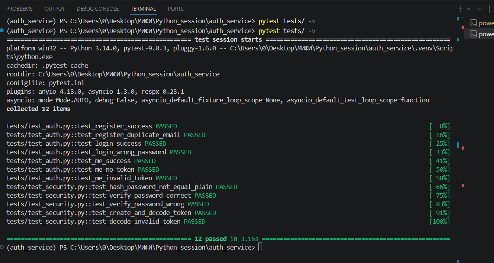

# Двухсервисная система LLM-консультаций

Система состоит из двух логически и технически независимых сервисов:
- **Auth Service** — регистрация, логин, выдача JWT
- **Bot Service** — Telegram-бот с LLM-консультациями через OpenRouter

Архитектура построена по принципу разделения ответственности: один сервис отвечает за аутентификацию, второй — за работу с LLM через Telegram.

## Структура проекта

Для обоих сервисов соблюдена модульная архитектура:
- **api/** — эндпоинты (FastAPI) или хэндлеры (aiogram).
- **core/** — конфигурация и безопасность.
- **db/** — модели БД и настройки.
- **schemas/** — Pydantic-схемы (включая строгую проверку email `surname@email.com`).
- **repositories/** — работа с базой данных.
- **services/** — интеграция с внешними API.
- **usecases/** — бизнес-логика.
- **infra/** — инфраструктура (Celery, Redis, RabbitMQ).

## Требования
- Python 3.11+
- Docker (RabbitMQ + Redis)
- Telegram Bot Token
- OpenRouter API Key

## Установка и запуск

### Auth Service
```bash
cd auth_service
pip install uv
uv venv
.venv\Scripts\activate
uv pip install -r pyproject.toml
uvicorn app.main:app --reload --host 0.0.0.0 --port 8000
```

### Bot Service
```bash
cd bot_service
uv venv
.venv\Scripts\activate
uv pip install -r pyproject.toml
```

### RabbitMQ и Redis
```bash
docker run -d --name rabbitmq -p 5672:5672 -p 15672:15672 rabbitmq:3-management
docker run -d --name redis -p 6379:6379 redis:7
```

### Celery
```bash
cd bot_service
celery -A app.infra.celery_app worker --loglevel=info -P solo
```

### Telegram bot
```bash
cd bot_service
python -m app.main
```

## Сценарий работы
1. Зарегистрируйся в Auth Service через Swagger: http://localhost:8000/docs
   * **Важно**: используй email формата `surname@email.com`.
2. Получи токен через `POST /auth/login`.
3. Отправь токен боту командой `/token`.
4. Спроси что угодно.

## Скриншоты
### Регистрация (POST /auth/register)

### Логин (POST /auth/login)

### Профиль (GET /auth/me)

### Telegram бот

### RabbitMQ очереди

### Celery worker

### Тестирование Auth Service

### Тестирование Bot Service


## Тестирование
### Auth Service
```bash
cd auth_service
pytest tests/ -v
```
### Bot Service
```bash
cd bot_service
pytest tests/ -v
```
